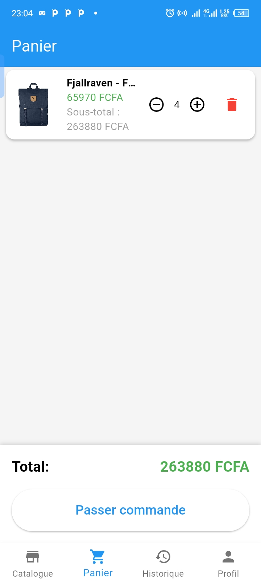
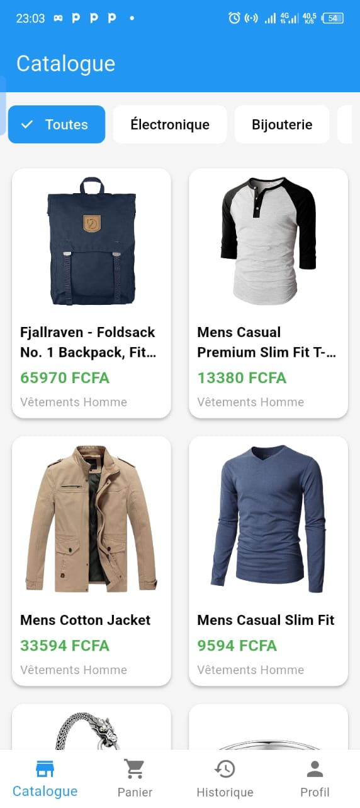
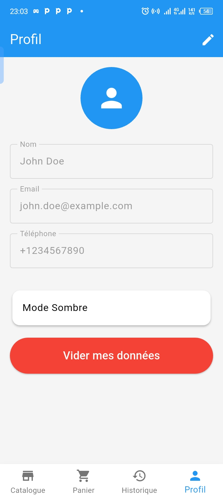

# MarketShop - Application E-Commerce (Version React Native)

**Réalisé par :** Tresor Kolombia

---

## 🛠 Technologie Utilisée
* **Technologie principale :** React Native (avec Expo)

## 📖 Description de l'application
MarketShop est une application mobile d'e-commerce complète et moderne. Elle permet aux utilisateurs de parcourir un catalogue de produits, de consulter les détails de chaque article (prix en FCFA, description, catégorie), d'ajouter des produits à leur panier, de passer une commande et de consulter l'historique de leurs achats. L'application supporte également un thème clair/sombre.

## ✨ Fonctionnalités implémentées
* ✅ Affichage du catalogue de produits
* ✅ Affichage des détails d'un produit
* ✅ Gestion du panier (Ajouter, modifier la quantité, supprimer)
* ✅ Validation de la commande (Checkout avec formulaire)
* ✅ Historique des commandes passées
* ✅ Gestion du profil utilisateur
* ✅ Support du Thème Clair / Sombre
* ✅ Conversion automatique des prix en FCFA
* ✅ Interface entièrement traduite en français

## 📦 Bibliothèques utilisées
* `react`: 19.1.0
* `react-native`: 0.81.5
* `expo`: ~54.0.33
* `@react-navigation/native` (et modules liés): ^7.2.4 (Pour la navigation par onglets et en pile)
* `axios`: ^1.16.0 (Pour les requêtes API réseau)
* `@react-native-async-storage/async-storage`: 2.2.0 (Pour la sauvegarde locale des données)

## 📸 Captures d'écran

## 🚧 Difficultés rencontrées et solutions
Lors du développement, l'une des principales difficultés a été la synchronisation de l'état global de l'application, en particulier pour maintenir le panier à jour à travers les différents écrans sans recharger systématiquement les données. Cela a été résolu en utilisant l'API `Context` de React (`CartContext`, `ThemeContext`), ce qui a permis de centraliser les données et de rendre les composants réactifs aux changements de manière fluide.

## 🚀 Améliorations possibles
Si j'avais eu plus de temps, j'aurais aimé implémenter un véritable système d'authentification (connexion/inscription) lié à une base de données distante comme Firebase ou Supabase. J'aurais également ajouté une barre de recherche avancée avec des filtres par catégorie et par prix pour faciliter la navigation dans le catalogue.

---

🔗 **Lien vers la version Flutter du projet :** [Insérez ici le lien de votre dépôt GitHub Flutter]
